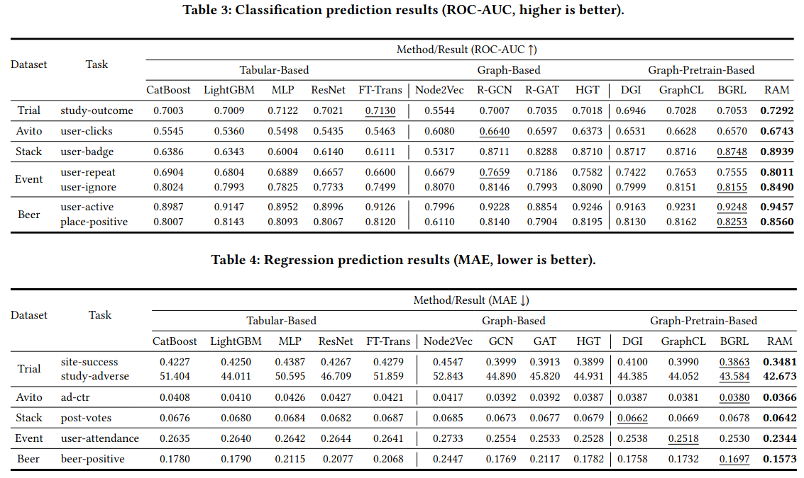

# From Schema to Signal: Retrieval-Augmented Modeling for Relational Data Analytics


[](https://flake8.pycqa.org/)


>***Retrieval-Augmented Modeling*** (RAM), a new relational data modeling paradigm that learns from both explicit structure and implicit semantics by integrating information retrieval (IR) with graph-based modeling.


## Overview


## Setup 

This project uses **Conda** for environment and dependency management, configured via [`environment.yml`](./environment.yml).

1. **Install Conda**

   Ensure you have [Miniconda](https://docs.conda.io/en/latest/miniconda.html) or [Anaconda](https://www.anaconda.com/) installed.

2. **Clone the repository**

   ```bash
   git clone <your-repo-url>
   cd <your-project-directory>
3. **Create the Conda environment**
   ```bash
   conda env create -f environment.yml
   ```
You will get a new environment named `deepdb` with all dependencies installed.

This codebase mainly depend on 
- relbench
- pyg
- torch
- torch_frame


## Structure

`model` contains the model and algorithm implementations

`utils` contains all related utility functions, including data structure definitions, data loading, graph building and prediction task definition.

`cmd` contains python scripts for training and inference of methods.
- `generate_table_data.py` to generate flatten tabular data from relational database
- `dnn_baseline_table_data.py` execute tabular learning baseline methods, includeing `MLP`, `ResNet`,`FTTrans`
- `graph_baseline.py` execute graph-based baseline methods, including `R-GCN`, `R-GAT`, `HGT`
- `ml_baseline.py` execute machine learning baseline methods, including `Catboost`, `LightGBM`
- `node2vec_baseline.py` execute node2vec baseline methods, including `Node2Vec`, `GraphSAGE`, `GAT`
- `pretrain_baseline.py` includes pretraining process, including graph-pretraining methods `DGI`, `GraphCL`, `BGRL`.
- `pretrain.py` includes pretraining process in RAM.
- `run.py` is the main script to run RAM, including training and inference.

Each cmd scripts has it own arguments, you can run `python <script_name>.py --help` to see the details of arguments.


`**_scripts` directories contains preprocessing scripts and retrieval building scripts in RAM for each database. Also, it contains some experiment snippets and some experiment results.


some integrated experiment shell scripts:
- `generate_table_data.sh` generate flatten tabular data for all databases and prediction tasks.
- `dnn_baseline_exe.sh` a example shell scripts to execute tabular learning experiments on all prediction tasks and dataabases.
- `graph_baseline_exe.sh` a example shell scripts to execute graph-based learning experiments on all prediction tasks and dataabases.
- `ml_baseline_exe.sh` a example shell scripts to execute machine learning experiments on all prediction tasks and dataabases.
- `sh_node2vec_exe.sh` a example shell scripts to execute node2vec experiments on all prediction tasks and dataabases.
- `sh_pretrain_exe.sh` a example shell scripts to execute pretraining experiments on all prediction tasks and dataabases.


## Experiments Results



## License
This project is licensed under the MIT License. See the [LICENSE](./LICENSE) file for details.